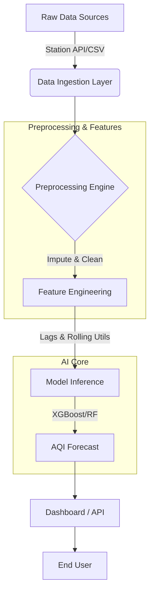
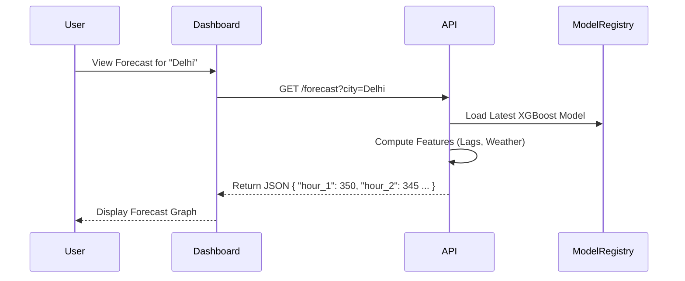

# System Architecture & Deployment Vision

This document outlines the architectural design of the AQI Forecasting System, including data flow, model pipeline, and future deployment strategies.

## 1. High-Level Architecture

The system is designed as a modular pipeline that ingests raw pollutant data, processes it into temporal features, and generates hourly forecasts using ensemble machine learning models.

## 2. Data Pipeline

1.  **Ingestion**: 
    *   **Historical**: CPCB/OpenAQ archives (CSV).
    *   **Live (Future)**: Real-time REST API polling from monitoring stations.
2.  **Processing**:
    *   **Cleaning**: Outlier removal using IQR.
    *   **Enrichment**: Merging with synthetic or API-based meteorological data (Temperature, Wind).
3.  **Featurization**:
    *   Creation of `AQI_lag_1`, `AQI_lag_24` to capture daily cycles.
    *   Rolling averages to smooth volatile sensor readings.

## 3. Next Steps & Deployment

 To move from this research notebook to a production system, we propose the following roadmap:

### Phase 1: API Development (`FastAPI`)
*   Wrap the trained XGBoost model in a Python FastAPI service.
*   Endpoint: `POST /predict` accepting `StationID` and recent pollutant history.

### Phase 2: Automated Retraining (`Airflow`)
*   Implement an Airflow DAG to retrain the model weekly using the latest data to handle concept drift (seasonality changes).

### Phase 3: User Dashboard (`Streamlit/React`)
*   Build a frontend to visualize:
    *   Current AQI Heatmap.
    *   6-Hour Forecast Curve.
    *   Health Advisories based on predicted AQI buckets.

## 4. Integration Diagram

